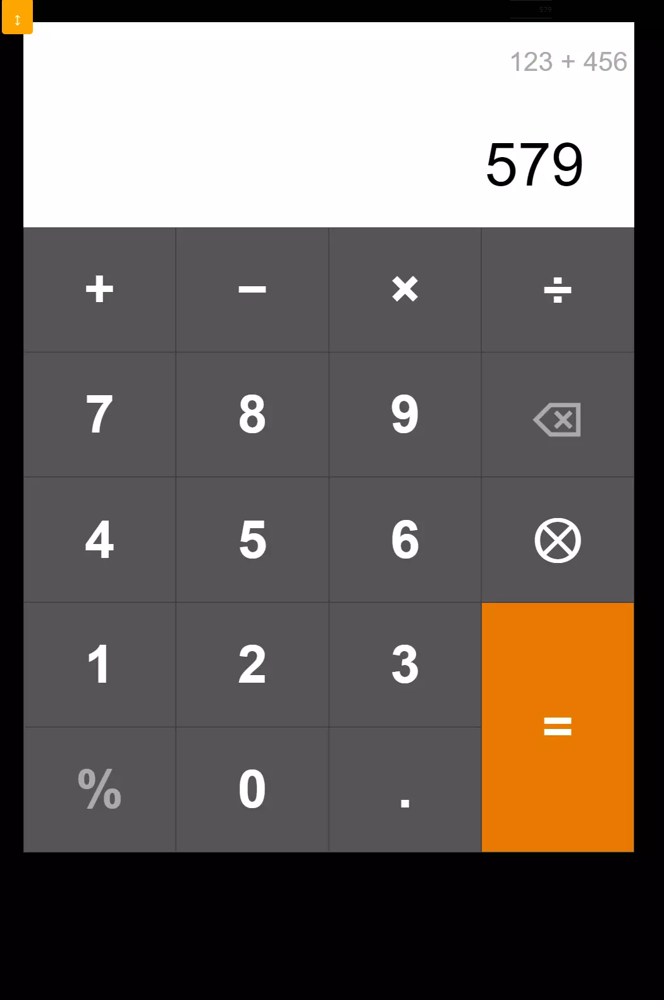

# Responsive calculator

Simple calculator that auto-adjusts size based on window height/width. Extra functions include a percent button and a keypress history.

## Limitations

Uses default JavaScript math functions. Currently prone to floating point rounding errors.
